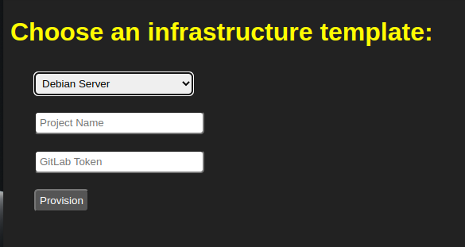

# Self-Service Infrastructure Portal

_The Self-Service Infrastructure Portal is a web application that allows users to choose an infrastructure template and provision it by triggering pipelines in a GitLab project. It provides a simple and user-friendly interface for selecting the desired template, entering the project name and GitLab token, and initiating the provisioning process._

<p align="center">
<br><br>

</p>

## Features

- Choose from various infrastructure templates, including Debian Server, Ubuntu Server, K8s Cluster, Windows Server, and 2 Linux VMs Network.
- Enter the project name and GitLab token for authentication.
- Trigger pipelines in a GitLab project based on the selected template and project details.
- Receive feedback on the successful provisioning of the infrastructure.

## Prerequisites

Before running the Self-Service Infrastructure Portal, ensure that you have the following installed:

- Go programming language
- GitLab account and access token

## Installation

1. Clone the repository to your local machine:

   ```bash
   git clone https://github.com/your-username/your-app.git

2. Navigate to the project directory:
   ```bash
   cd your-app
3. Build and run the application:
   ```bash
   go run .
4. Access the application in your web browser at http://localhost:8080

## Usage

1. Open the application in your web browser at http://localhost:8080.
2. On the selection page, choose an infrastructure template from the dropdown menu.
3. Enter the project name and GitLab token in the provided input fields.
4. Click the "Provision" button to initiate the provisioning process.
5. Wait for the application to trigger the appropriate pipeline in the GitLab project.
6. Once the provisioning is complete, a success message will be displayed.

## Contributing
Contributions are welcome! If you encounter any issues or have suggestions for improvements, please create an issue or submit a pull request.

## License
This project is licensed under the MIT License.